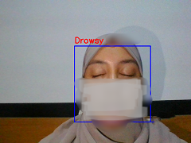
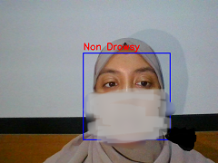
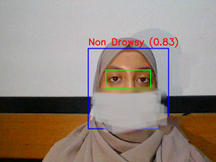

# Drowsiness Detection - Real-Time

---

La **somnolence** est un état physiologique caractérisé par un **besoin accru de sommeil**, une baisse de vigilance et un ralentissement des fonctions cognitives. Elle peut survenir dans de nombreuses situations : au travail, en conduisant, ou lors d’activités nécessitant de la concentration.  

L’intérêt de détecter la somnolence est multiple :  

1. **Prévention des accidents**  
   - La somnolence réduit la réactivité et la capacité de prise de décision.  
   - Elle est responsable de nombreux accidents dans des contextes critiques (conduite, pilotage, contrôle de machines).  

2. **Santé et bien-être**  
   - Une détection précoce de la somnolence peut encourager des pauses ou du repos, limitant les risques pour la santé.  
   - Permet de mieux comprendre les habitudes de sommeil et la fatigue accumulée.  

3. **Applications professionnelles**  
   - Surveillance de la vigilance dans les métiers à risque (chauffeurs, opérateurs de machines, personnel médical de nuit).  
   - Optimisation des horaires de travail et réduction des erreurs dues à la fatigue.  

4. **Avantages des solutions technologiques**  
   - Les systèmes de vision par ordinateur et d’apprentissage profond permettent une **détection non invasive et en temps réel**.  
   - Cela offre une alternative pratique aux méthodes traditionnelles (questionnaires, capteurs physiologiques) tout en restant efficace et automatisé.

---

## 1. Description
Ce projet implémente un **système de détection de somnolence en temps réel** utilisant l'apprentissage profond (**Deep Learning**) et la vision par ordinateur (**Computer Vision**). Le système utilise la webcam pour détecter les visages et les yeux, puis prédit si la personne est **somnolente (Drowsy)** ou **éveillée (Non Drowsy)** grâce à un modèle entraîné sur des images d’yeux.  

---

## 2. Dataset
Le modèle a été entraîné avec le dataset disponible sur Kaggle : [Driver Drowsiness Dataset (DDD)](https://www.kaggle.com/datasets/ismailnasri20/driver-drowsiness-dataset-ddd).  

- **Nombre de classes :** 2  
  - `Drowsy` : images de personnes somnolentes  
  - `Non Drowsy` : images de personnes éveillées  
- **Utilisation :** Le dataset a été utilisé pour entraîner le modèle `ModelDrowsiness.h5` inclus dans le projet.

---

## 3. Technologies utilisées
Ce projet utilise plusieurs technologies et librairies pour mettre en place un système de détection de somnolence performant et en temps réel. Voici un aperçu détaillé :

### - Python
Langage principal du projet, choisi pour sa **simplicité**, sa **portabilité** et sa richesse en librairies pour le machine learning et la vision par ordinateur.

### - TensorFlow & Keras
- **TensorFlow** : bibliothèque open-source pour le deep learning.  
- **Keras** : API haut niveau intégrée à TensorFlow pour construire et entraîner des modèles de manière simple et lisible.  
- Utilisés pour construire le modèle CNN basé sur **InceptionV3**, l’entraîner et faire des prédictions en temps réel.

### - InceptionV3
- Modèle CNN pré-entraîné sur **ImageNet**.  
- Permet d’extraire des caractéristiques complexes des images (textures, formes, motifs des yeux).  
- Réduit le temps d’entraînement grâce au **transfer learning** et offre une haute précision même avec un dataset limité.

### - OpenCV
Bibliothèque de vision par ordinateur.  
Utilisée pour :
- Capturer des vidéos depuis la webcam  
- Détecter les visages et les yeux en temps réel via **Haar Cascades**  
- Dessiner des rectangles et labels sur la vidéo pour visualiser la prédiction  

### - NumPy
Librairie pour le calcul scientifique et le traitement des tableaux.  
Permet de manipuler les images sous forme de matrices et préparer les données avant de les passer au modèle.

### - Pandas
Librairie pour la manipulation et l’analyse de données.  
Utile pour organiser et inspecter le dataset, et créer des tableaux et rapports pour l’évaluation des performances.

### - Matplotlib & Seaborn
Librairies de visualisation de données.  
Permettent de :
- Tracer les **courbes d’accuracy et de loss** pendant l’entraînement  
- Afficher la **matrice de confusion** pour évaluer la performance du modèle  
- Rendre l’analyse plus intuitive et visuelle

---

## 4. Architecture du modèle
Le modèle utilise **InceptionV3 pré-entraîné** comme base, auquel on ajoute des couches personnalisées pour la classification binaire (Drowsy / Non Drowsy).

## Architecture du modèle Driver Drowsiness Detection

Le modèle utilise **InceptionV3 pré-entraîné sur ImageNet** comme extracteur de caractéristiques et ajoute des couches fully connected pour la classification binaire (Drowsy / Non Drowsy).

| Couche / Bloc | Sortie (output shape) | Paramètres | Description |
|---------------|--------------------|------------|------------|
| **Input Layer** | `(None, 299, 299, 3)` | 0 | Images RGB de taille 299×299 |
| **InceptionV3 Base (pretrained)** | `(None, 8, 8, 2048)` | 21,802,784 (non entraînables) | Réseau pré-entraîné sur ImageNet, toutes les couches gelées (`trainable=False`) |
| **GlobalAveragePooling2D** | `(None, 2048)` | 0 | Réduit chaque carte de caractéristiques 8×8 en un vecteur de 2048 valeurs par moyenne globale |
| **Dense (Fully Connected)** | `(None, 128)` | 262,272 | Couche entièrement connectée avec 128 neurones et activation ReLU |
| **Dropout** | `(None, 128)` | 0 | Régularisation pour éviter le sur-apprentissage, taux = 0.4 |
| **Dense (Fully Connected)** | `(None, 64)` | 8,256 | Couche entièrement connectée avec 64 neurones et activation ReLU |
| **Dropout** | `(None, 64)` | 0 | Régularisation, taux = 0.3 |
| **Dense (Output)** | `(None, 1)` | 65 | Couche de sortie pour classification binaire avec activation Sigmoid |

**Résumé général :**
- **Total de paramètres :** ~22 millions  
- **Paramètres entraînables :** ~270 593 (couches ajoutées)  
- **Paramètres non entraînables :** 21 802 784 (InceptionV3 pré-entraîné)  

**Explication :**  
Le modèle utilise InceptionV3 comme extracteur de caractéristiques. Les couches pré-entraînées sont gelées pour conserver les connaissances acquises sur ImageNet. Ensuite, un `GlobalAveragePooling2D` réduit les dimensions et deux couches `Dense` avec `Dropout` apprennent la classification binaire Drowsy / Non Drowsy. La sortie est une couche sigmoïde donnant la probabilité d’endormissement.

---

## 6. Résultats – Détection en temps réel
Le système permet de détecter la somnolence **en temps réel** à partir d’une webcam grâce à la combinaison de la détection de visage/yeux avec OpenCV et du modèle CNN entraîné.

### 7. Fonctionnement

- La webcam capture l’image du visage en continu.  
- Les **Haar Cascades** détectent les **visages et les yeux**.  
- Pour chaque œil détecté :  
  - L’image est redimensionnée à 299x299 (taille d’entrée du modèle)  
  - Normalisée et envoyée au modèle CNN  
  - Le modèle prédit la probabilité de somnolence  
- Le label `Drowsy` ou `Non Drowsy` est affiché **en temps réel** sur la vidéo, avec un rectangle autour des yeux et du visage.

### Exemple d’images de détection

| Drowsy | Non Drowsy |
|--------|------------|
|  |  |

### 8. Interface visuelle

- **Rectangle bleu** autour du visage détecté  
- **Rectangle vert** autour des yeux  
- **Label rouge** indiquant l’état de vigilance (`Drowsy` ou `Non Drowsy`) et la probabilité  

